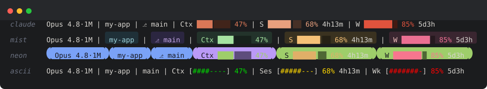

<h1 align="center">@ttigger/claude-status</h1>

<p align="center">A portable Claude Code statusline HUD — model, project, git, context, and real usage limits, right in your terminal.</p>

<p align="center">
  <a href="https://www.npmjs.com/package/@ttigger/claude-status"></a>
  <a href="https://github.com/TTigger/claude-status/actions/workflows/ci.yml"></a>
  <a href="https://nodejs.org">=18"></a>
  <a href="./LICENSE"></a>
  <a href="https://packagephobia.com/result?p=@ttigger/claude-status"></a>
</p>

<p align="center">
  
</p>

```sh
npx @ttigger/claude-status install
```

---

## Why

- **Usage limits in the CLI** — brings the claude.ai Session (5 h rolling) and Weekly (7 d) usage meters and their reset countdowns into every Claude Code session; no browser tab required.
- **One command, nothing to clone** — `npx @ttigger/claude-status install` fetches and wires everything; works on any machine with Node ≥ 18.
- **7 styles including Claude brand** — coral `claude` default, `minimal`, `classic`, `tech` (Nerd Font), `data` (braille), `ascii` (most compatible), `emoji`.
- **Single-line adaptive layout** — `auto` layout packs everything onto one line and gracefully wraps to two or three lines only when the terminal is narrow.
- **Theme-aware colors** — reads `~/.claude/settings.json` and mirrors Claude Code's light/dark/system theme; no manual palette config required.
- **`cc` launcher** — a tiny `cc` shim that forwards all args to `claude`, saving keystrokes on every invocation.
- **Config with live preview** — `claude-status config set` and `claude-status preview` let you tweak and instantly see the result in your actual terminal colors.
- **Pure Node, cross-OS** — CommonJS, zero runtime dependencies, works on Windows, macOS, and Linux.

---

## Quick Start

```sh
npx @ttigger/claude-status install
```

Then open a new Claude Code session. The HUD appears automatically at the top of every prompt.

---

## The HUD

```
 Opus 4.8·1M | claude-status | main
Ctx ▰▰▱▱▱▱ 23% 47k | compact 60%
Sess ▰▰▰▰▰▱ 52% 3h12m | Wk ▰▰▱▱▱ 31% 4d6h
```

| Element | What it shows |
|---|---|
| **Model** | Current model name, e.g. `Opus 4.8`. The `·1M` tag appears when the 1 M-token context window is active. |
| **Project folder** | The base name of the current working directory. |
| **Git branch** | Active branch name (blank when not in a git repo). |
| **Context bar + %** | A progress bar showing how full the context window is, plus a percentage and token count in thousands (e.g. `47k`). |
| **Auto-compact remaining** | The percentage of context headroom left before Claude Code triggers auto-compaction. **This value is approximate** — the threshold is configurable (default ~83.5 %) and may differ from Claude Code's internal trigger. |
| **Session usage** | Rolling 5-hour usage bar + percentage + countdown to reset (e.g. `3h12m`). |
| **Weekly usage** | 7-day usage bar + percentage + countdown to reset (e.g. `4d6h`). |

---

## Styles

Seven styles are available. Choose with `claude-status config set style <name>`.

### `claude` (default — Claude coral brand)

```
Opus 4.8·1M | claude-status | main
Ctx ▰▰▱▱▱▱ 23% 47k | compact 60%
Sess ▰▰▰▰▰▱ 52% 3h12m | Wk ▰▰▱▱▱ 31% 4d6h
```

### `minimal`

```
Opus 4.8·1M | claude-status | main
ctx ▪▪░░░░ 23% 47k · compact 60%
ses ▪▪▪░░░ 52% 3h12m · wk ▪▪░░░ 31% 4d6h
```

### `classic` (fallback default)

```
Opus 4.8·1M | claude-status | ⎇ main
Ctx ▓▓░░░░░░ 23% · 47k | compact in 60%
Sess ▓▓▓▓▓░ 52% · 3h12m | Wk ▓▓░░░ 31% · 4d6h
```

### `tech` (needs Nerd Font)

```
 Opus 4.8 1M │  claude-status │  main
󰍛 ███▱▱▱▱ 23% 47k │ ♻ 60%
 █████▱ 52% 3h12m │  ██▱▱▱ 31% 4d6h
```

### `data`

```
Opus-4.8[1M] | claude-status | git:main
CTX ⣿⣿⣀⠀⠀ 23.4% 47.0k/200k | AC 60.0%
5H  ⣿⣿⣿⣀⠀ 52.1% ⟳3h12m | 7D ⣿⣀⠀⠀⠀ 31.0% ⟳4d6h
```

### `ascii` (most compatible)

```
Opus 4.8 1M | claude-status | main
Ctx [##------] 23% 47k | compact 60%
Ses [####----] 52% 3h12m | Wk [##------] 31% 4d6h
```

### `emoji`

```
🤖 Opus 4.8·1M | 📁 claude-status | 🌿 main
🧠 ▓▓░░░░ 23% 47k | ♻️ 60%
⏱️ ▓▓▓▓▓░ 52% 3h12m | 📅 ▓░░░░ 31% 4d6h
```

---

## Configuration

Configuration is stored in `~/.claude/claude-status.config.json`. Only the keys you change are written — it is a **deep merge**, so you never need to specify the full config.

### CLI

| Command | Description |
|---|---|
| `claude-status config set <key> <value>` | Set a single config key |
| `claude-status config get <key>` | Print the current value of a key |
| `claude-status config list` | Print all current settings |
| `claude-status config reset [key]` | Reset one key (or all) to defaults |

### Dotted keys for nested settings

```sh
claude-status config set elements.weekly false       # hide weekly usage
claude-status config set colorThresholds.green 40    # green up to 40 %
claude-status config set colorThresholds.yellow 70   # yellow 40–70 %, red above
claude-status config set autoCompact.thresholdPct 80 # approximate compaction threshold
claude-status config set barWidth 10                 # wider bars
claude-status config set style minimal               # switch style
claude-status config set layout two                  # two-line layout
```

### Example config file

```json
{
  "style": "claude",
  "layout": "auto",
  "barWidth": 8,
  "colorThresholds": {
    "green": 50,
    "yellow": 80
  },
  "elements": {
    "model": true,
    "project": true,
    "gitBranch": true,
    "context": true,
    "autoCompact": true,
    "session": true,
    "weekly": true
  },
  "autoCompact": {
    "thresholdPct": 83.5
  }
}
```

Only include keys you want to override — unset keys fall back to defaults.

---

## Preview

See the HUD rendered in your actual terminal colors before committing to a style:

```sh
claude-status preview --style tech
claude-status preview --style emoji --layout three
```

`preview` is a live WYSIWYG render — it applies the real theme colors from `~/.claude/settings.json` and prints every layout variant side by side.

---

## Commands

| Command | Description |
|---|---|
| `npx @ttigger/claude-status install` | Install / re-install the HUD into Claude Code |
| `claude-status uninstall` | Remove the HUD and restore `~/.claude/settings.json` from backup |
| `claude-status config set <key> <value>` | Set a config value |
| `claude-status config get <key>` | Get a config value |
| `claude-status config list` | List all config values |
| `claude-status config reset [key]` | Reset to default(s) |
| `claude-status preview [--style s] [--layout l]` | Live WYSIWYG preview |
| `claude-status help` | Print help |

---

## Updating / Uninstall

**Update to the latest version:**

```sh
npx @ttigger/claude-status@latest install
```

**Uninstall:**

```sh
claude-status uninstall
```

The uninstaller restores `~/.claude/settings.json` from the `.bak` backup created during install, so your previous hooks configuration is preserved.

---

## `cc` Launcher

The `cc` bin is a thin wrapper that calls `claude` and passes all arguments through unchanged. It saves a few keystrokes on every invocation.

**Name collision on macOS / Linux:** `cc` is the POSIX name for the system C compiler. The installer detects this and warns you on macOS and Linux so you can make an informed choice. Windows has no such collision.

If you would rather use a different alias, pass `--alias` during install:

```sh
npx @ttigger/claude-status install --alias clc
```

This registers `clc` instead of `cc` so there is no conflict with the system compiler.

---

## Security

No data leaves your machine — the package only reads/writes `~/.claude/settings.json` (with a `.bak` backup), reads your config and theme, runs local `git`, and spawns `claude`. See [SECURITY.md](./SECURITY.md) for the full data boundary statement.

---

## License

MIT © 2026 ttigger
